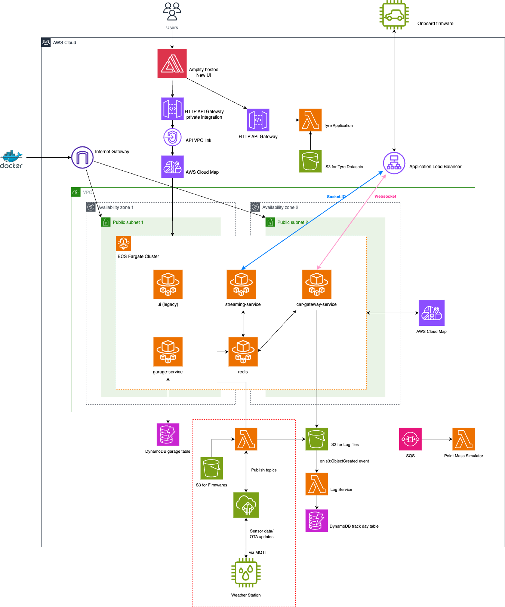

## Introduction
- Integration of weather station for monitoring local weather data

## Proposal

- **Connection** MQTT via AWS IoT Core and Lambda
- **Description**
Data are recorded and converted to MsgPacks by station firmware (similar to the onboard firmware).
MsgPacks are transmitted to AWS and relayed to other services for usage and logging.
- **Features**
  - **Lightweight, efficient** The change in local weather data is slow compare to onboard sensor data so it may not require a
  streaming service for real-time monitoring. MQTT is a good choice for transmitting data in larger intervals as it saves carrier
  usage cost.
  - **Scalable** With the help of AWS IoT Core, more sensors(not limited to weather stations) can be added with ease. Stations can be set up in different locations
  and users may switch the monitoring of data by subscribing to different MQTT topics.
  - **Secure** AWS IoT certificates ensures only authenicated devices can send/receive data.
  - **Low Cost** On top of MQTT having a lower data transfer cost. The employment of AWS Lambda also alleviate the cost of setting
  up additional EC2 instance servers for data processing.
  - **OTA update** OTA firmware updates can also be done by MQTT after establishing some protocols. Firmware files can be uploaded to S3 bucket
  either by developers through API gateways then initiated manually/automatically by publishing to corresponding MQTT topic(s).

## Services Included
- **IoT Core**
  - **Usages**
    - Management, adding, grouping of IoT devices
    - Receive MQTT message from Lambda and publish to corresponding devices
    - Forwarding MQTT message to Lambda to process

- **Lambda**
  - **Usages**
    - Process MQTT message to desired format and forward to logging service and redis
    - (optional) Upon new object created event on Firmware S3 bucket, create MQTT commands for OTA update.

- **S3 bucket**
  - **Usages**
    - Storing OTA firmware files.

## Terraform
The deployment of services mentioned can be added on to the existing terraform project.
- Define the AWS service instances with their corresponding configurations.
- Run terraform plan to preview the changes made.
- Run terraform apply to apply the new changes to AWS
- (optional) Use CI/CD pipelines such as github Actions to deploy to UAT env for development versions / production when a version is released.